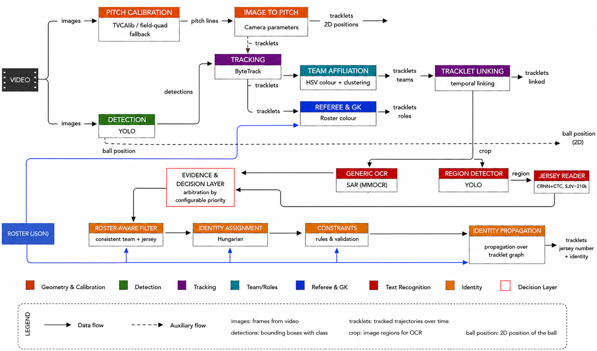

# Football Player Identification

Broadcast-video football tracking and semantic player identification pipeline for thesis experiments on **Game State Reconstruction**.

The project does not stop at object detection or multi-object tracking. After producing player positions and tracklets, it tries to reconstruct the match state by assigning semantic information to every stable tracklet:

- team;
- player/referee/goalkeeper role;
- jersey number;
- real roster identity when evidence is strong enough;
- `unknown` when the evidence is weak or contradictory.

The central design choice is conservative identification: a missing identity is better than a wrong identity.

## What The Pipeline Does



Stage order as executed by `ft.pipeline.run_pipeline`. Note that team
assignment runs twice, with tracklet linking interleaved between the passes:
the first pass supplies the team consistency gate the linker needs, the second
pass re-estimates teams on the linked tracklets.

```text
video
  -> scene-cut detection
  -> YOLO detector
  -> ByteTrack tracking
  -> pitch transform (TVCalib when available, field-quad fallback otherwise)
  -> team assignment, first pass
  -> referee colour cues from roster metadata
  -> tracklet linking (optionally PRTReID-assisted)
  -> team assignment, second pass
  -> goalkeeper detection
  -> semantic groups
  -> crop and metadata export
  -> jersey number recognition
       -> primary OCR (EasyOCR / MMOCR, optional template matching)
       -> region detector + CTC recogniser
       -> decision layer arbitrates between the sources
  -> roster-aware OCR filtering
  -> Hungarian tracklet-to-player assignment, optionally scoped by scene cuts
  -> hard identity constraints
  -> annotated video and diagnostics
```

The output is an annotated video plus JSON/CSV artifacts that explain why each tracklet was, or was not, assigned to a real player.

## Semantic Groups

The pipeline separates the two real teams from richer semantic groups.

`team_id` is used for identity assignment:

```text
1 = team 1
2 = team 2
```

`semantic_group_id` is used for visualization and diagnostics:

```text
1 = team1 players
2 = team2 players
3 = team1 goalkeeper
4 = team2 goalkeeper
5 = referees
```

## Current Capabilities

- YOLO + ByteTrack tracking for `person` and `ball` detectors.
- Modular YOLO detection stage with ByteTrack association as the validated default.
- Tracklet linking with gates on temporal overlap, distance, team consistency and visual appearance.
- Scene-cut detection with optional tracker and identity-assignment reset.
- Team assignment from visual crop colours, with per-frame team evidence for detecting ID switches.
- Referee detection from roster-provided kit colours, for example `yellow` or `light_blue`.
- Goalkeeper detection from roster-provided kit colours, with optional team correction when the colour evidence is strong.
- Jersey OCR with:
  - multi-pass crop sampling;
  - EasyOCR backend;
  - optional MMOCR backend;
  - combined MMOCR + EasyOCR proposal voting when OpenMMLab is available;
  - optional jersey font template matching using `docs/numberFont.jpg`;
  - crop-level aggregation before tracklet voting.
- Roster-aware OCR filtering:
  - removes or degrades jersey numbers that do not exist in the roster for that team;
  - can promote a valid roster candidate from the OCR distribution.
- Localized number-region OCR:
  - samples candidate number regions inside player boxes;
  - stores raw detections and per-tracklet evidence separately from legacy OCR;
  - can contribute an optional cost term to identity assignment.
- PRTReID-based tracklet descriptors for conservative linking experiments.
- Evidence-based jersey-number decision layer:
  - each recognizer (primary OCR, region CTC) appends immutable evidence instead of mutating shared state;
  - `ft.decision.jersey_policy` arbitrates between sources via a configurable, ordered `decision_policy.jersey_number.sources` list, with `fallback` or `abstain` semantics;
  - promoting a recognizer to decide is a configuration change, not a code change;
  - `scripts/verify_evidence_additive.py` checks that a config change to this layer is bit-identical to the legacy path when no source list is overridden;
  - the default profile (`configs/default.yaml`) currently promotes the region CTC recognizer ahead of the primary OCR (`sources: [jersey_region_ctc, jersey_ocr_primary]`), validated on SoccerNet-GSR across the offline, pipeline, and GS-HOTA surfaces; out-of-domain broadcast video has not been validated to the same standard.
- Hungarian assignment from tracklets to roster players, with optional per-scene assignment scope.
- Identity constraints:
  - no duplicate `player_id` in the same frame;
  - no duplicate `(team_id, jersey_number)` in the same frame;
  - no jersey number outside the team roster;
  - goalkeeper-only jersey numbers are cleared from non-goalkeepers;
  - non-goalkeeper jersey numbers are cleared from goalkeeper tracklets;
  - persistent per-frame team conflicts can split a contaminated `display_track_id`.
- W&B logging for runs and metadata artifacts.

## Repository Layout

```text
ft/
  calibration/              pitch transform and automatic fallback calibration
  core/                     immutable Evidence records and the EvidenceStore
  decision/                 jersey_policy: arbitrates between evidence sources
  export/                   CSV, JSON, crop and metadata artifact export
  features/                 team, referee, goalkeeper, OCR and visual features
  identity/                 roster parsing, Hungarian assignment and constraints
  linking/                  tracklet linking
  tracking/                 detection records, YOLO stage and ByteTrack association
  utils/                    video IO and W&B helpers
  visualization/            overlay rendering

configs/
  default.yaml              main end-to-end configuration
  bytetrack_tracking_debug.yaml
  tvcalib_calibration.example.yaml

docs/
  numberFont.jpg            jersey-number font reference for template matching

evaluation/
  gsr_jersey_ocr/           controlled SoccerNet-GSR OCR evaluation

scripts/
  train_yolo_gsr_full.py    SoccerNet-GSR conversion and YOLO training
  run_costume_videos.sh     helper for custom videos

tests/
  test_identity.py          lightweight regression tests
```

Local videos, outputs, W&B folders, model weights and generated artifacts are intentionally ignored by git.

## Detection And Tracking Benchmark

The reproducible SoccerNet-GSR benchmark reports detection metrics, standard
multi-object tracking metrics on both raw and FT-linked identities, bootstrap
aggregates, and diagnostic charts. See
[`docs/gsr_detection_tracking_benchmark.md`](docs/gsr_detection_tracking_benchmark.md)
for the frozen protocol and remote commands.

## Results

End-to-end performance is measured with GS-HOTA (Somers et al., CVPR 2024),
which multiplies a localisation similarity on the pitch by an identity
similarity requiring team, role and jersey number to all agree.

Two configurations differing in one line, the ordering of the jersey sources,
were compared on a 12-sequence validation pilot and then on 12 sequences drawn
at random from the frozen test split under a
[pre-registered protocol](evaluation/jersey_heldout_manifests/gsr_test_final_v1_preregistration.md).
Arm A puts the primary OCR first, arm B the region CTC recogniser.

| Block | Arm A | Arm B | Delta | 95% CI |
|---|---:|---:|---:|---|
| Validation (12 seq) | 0.2097 | 0.2870 | +0.0772 | [0.0476, 0.1067] |
| Test (12 seq) | 0.2759 | 0.3235 | +0.0476 | [0.0262, 0.0685] |

On the test block arm B wins in 10 sequences, ties 1 and loses 1, two-sided
sign test p = 0.012. The gain is carried by GS-DetA (+0.0566, [0.0293,
0.0838]); GS-AssA and GS-LocA have intervals containing zero, as expected for
two arms sharing every stage except the jersey source. Arm B is the promoted
default.

### Oracle ablation

Each module in turn is replaced with ground truth and GS-HOTA recomputed, to
attribute the distance from a perfect score. Test block, macro mean over 12
sequences, 95% sequence-level bootstrap CI.

| Configuration | jersey | Arm A | Arm B |
|---|---|---:|---:|
| baseline | real | 0.285 [0.221, 0.352] | 0.338 [0.268, 0.407] |
| + oracle calibration | real | 0.392 [0.308, 0.484] | 0.470 [0.378, 0.571] |
| + oracle team | real | 0.309 [0.256, 0.362] | 0.365 [0.314, 0.419] |
| + oracle role | real | 0.292 [0.229, 0.358] | 0.344 [0.275, 0.414] |
| all attributes but jersey | real | 0.444 [0.375, 0.523] | 0.528 [0.456, 0.613] |
| + oracle jersey | oracle | 0.463 [0.369, 0.534] | 0.464 [0.370, 0.536] |
| all attributes but calibration | oracle | 0.522 [0.473, 0.571] | 0.523 [0.474, 0.572] |
| all attributes but team | oracle | 0.671 [0.557, 0.763] | 0.673 [0.558, 0.764] |
| all attributes but role | oracle | 0.723 [0.664, 0.779] | 0.724 [0.666, 0.781] |
| all attributes oracle | oracle | 0.752 [0.692, 0.811] | 0.754 [0.694, 0.812] |
| full oracle (sanity) | oracle | 1.000 | 1.000 |

The rows are grouped by whether the jersey number is real or replaced. The
difference between the arms survives throughout the first group, between 0.052
and 0.084 points, and collapses to 0.001-0.002 throughout the second: the
entire difference between the two configurations is the jersey number, which
is what the ablation is meant to establish.

Isolated cost of each module, meaning what it still costs once every other one
is perfect. Costs are not additive, because GS-HOTA multiplies localisation by
identity and failures on the same subject overlap.

| Module | Validation | Test |
|---|---:|---:|
| jersey number | 0.281 | 0.226 |
| detection and tracking | 0.257 | 0.246 |
| calibration | 0.231 | 0.231 |
| team | 0.181 | 0.081 |
| role | 0.161 | 0.029 |

Jersey, detection and calibration agree between the two blocks and no single
one of them dominates. Team and role do not agree, and the reason is the team
stage abstaining rather than being wrong: it leaves `team_id` empty on roughly
half the players in six of the twelve validation sequences, against one of
twelve on test. The team figure therefore measures abstention as much as
misclassification, and its ranking against the other modules is a property of
the block rather than of the system.

Reproduce with `scripts/run_gsr_gs_hota_benchmark.py`,
`scripts/aggregate_gsr_gs_hota_benchmark.py` and
`scripts/aggregate_gs_hota_ablation.py`; the full test-split run is driven by
`scripts/run_test_final_v1.sh`. Provenance for every number is recorded in
[`docs/ablation_study_results.md`](docs/ablation_study_results.md) and
[`docs/additional_thesis_metrics.md`](docs/additional_thesis_metrics.md).

### Caveats

- One test sequence, SNGS-125, has 56.5% of its annotations without pitch
  coordinates. Those subjects cannot be scored by GS-HOTA and are excluded,
  while the sequence still carries a full one-twelfth of the macro mean. It is
  retained rather than dropped, because the condition depends only on the
  annotations and removing it after seeing results would be selection.
  Excluding it gives +0.0458 instead of +0.0476.
- The test split is not untouched: it had been used once before, for the
  recogniser pretraining comparison. This is a second use and is disclosed as
  such in the pre-registration.
- These results are SoccerNet-GSR. Out-of-domain behaviour is different and is
  described under Current Limitations.
- The team stage abstains far more often than expected on some sequences. On
  SNGS-137 it emits no team at all, and since GS-HOTA requires team, role and
  jersey to agree simultaneously, that sequence scores only on referees and is
  structurally blind to the A/B comparison: both arms return 0.0925 despite
  arm B reading 0.609 jersey accuracy against 0.464. It is kept in the mean, so
  the reported difference is conservative by one sequence out of twelve.

## Installation

Basic editable install:

```bash
python3 -m venv .venv
source .venv/bin/activate
python3 -m pip install --upgrade pip
python3 -m pip install -r requirements.txt
python3 -m pip install -e .
```

OCR extras:

```bash
python3 -m pip install easyocr pytesseract
```

MMOCR is optional and should normally live in a separate environment because
the OpenMMLab stack has strict `torch` / `mmcv` / `mmdet` compatibility
requirements. If MMOCR is unavailable, `mmocr_easyocr` records the failed import
and falls back to EasyOCR where possible.

On the thesis server, the lightweight environment is:

```bash
cd /home/cappetti/FT
conda activate tesi
python3 -m pip install -r requirements.txt
python3 -m pip install -e .
```

The MMOCR experiments were run from a dedicated `mmocr` conda environment.

## Required Inputs

For a full run you need:

- a broadcast video;
- a YOLO detector checkpoint;
- optionally a roster JSON.

Expected custom-video structure:

```text
costume-video/<MatchName>/<MatchName>.mp4
costume-video/<MatchName>/<MatchName>.json
```

Example:

```text
costume-video/Roma-Verona/Roma-Verona.mp4
costume-video/Roma-Verona/Roma-Verona.json
```

`costume-video/` is ignored by git except for its placeholder files.

## TVCalib Calibration

The default calibration remains the lightweight field-quad fallback. For runs
where position priors matter, the pipeline can now consume TVCalib
`per_sample_output.json` files and use one homography per sampled frame.

Expected TVCalib input:

```text
evaluation_outputs/tvcalib/<MatchName>/per_sample_output.json
```

The file may be JSONL as produced by TVCalib, a JSON list, or a dict of keyed
records. Each record must contain a `homography` field and should include an
`image_id`, `image_ids`, `frame`, or `frame_index` so FT can align it to video
frames. Numeric suffixes such as `frame_000250.jpg` are interpreted as frame
numbers.

Example override:

```yaml
base_config: default.yaml

calibration:
  enabled: true
  auto: false
  tvcalib:
    enabled: true
    path: evaluation_outputs/tvcalib/Inter-Juve/per_sample_output.json
    per_frame: true
    coordinate_system: tvcalib_centered
    frame_offset: 0
    nearest_frame: true
    max_frame_gap: 75
```

`coordinate_system: tvcalib_centered` converts TVCalib/SoccerNet centered field
coordinates into FT pitch meters `[0, 105] x [0, 68]`. Use
`coordinate_system: ft` only if the homography is already in FT's top-left pitch
coordinate system.

The run writes calibration diagnostics to:

```text
artifacts/.../metadata/<video_id>_calibration.json
```

## Roster Format

The roster is a list of players and match officials.

```json
[
  {
    "player_id": "team1_10",
    "name": "Example Player",
    "team_id": 1,
    "jersey_number": 10,
    "role": "player",
    "position_prior": [46.0, 24.0],
    "visual_embedding": null,
    "metadata": {
      "team": "Team 1",
      "role_hint": "striker"
    }
  },
  {
    "player_id": "team1_gk_01",
    "name": "Goalkeeper",
    "team_id": 1,
    "jersey_number": 1,
    "role": "goalkeeper",
    "position_prior": [8.0, 34.0],
    "visual_embedding": null,
    "metadata": {
      "team": "Team 1",
      "kit_color": "black"
    }
  },
  {
    "player_id": "referee_yellow",
    "name": "Referee",
    "team_id": null,
    "jersey_number": null,
    "role": "referee",
    "position_prior": null,
    "visual_embedding": null,
    "metadata": {
      "kit_color": "yellow"
    }
  }
]
```

Rules:

- `team_id` should be `1` or `2` for players.
- `team_id` should be `null` for referees.
- `jersey_number` must be between `1` and `99` when present.
- each team should contain each jersey number at most once.
- `role` is usually `player`, `goalkeeper`, `substitute` or `referee`.
- `position_prior` is optional and uses a 105 x 68 pitch coordinate system.

Supported named kit colours include:

```text
black
yellow
fluorescent_yellow
orange
red
blue
light_blue
```

Hex colours such as `#00aaff` are also accepted.

## Running One Video

```bash
python3 -m ft.cli run \
  --config configs/default.yaml \
  --video-path costume-video/Roma-Verona/Roma-Verona.mp4 \
  --model-path runs/detect/runs/ft_yolo_gsr/yolo26s_gsr_person_ball_768_e202/weights/best.pt \
  --output-path output_videos/costume-video/Roma-Verona_ft.mp4 \
  --artifacts-dir artifacts/costume-video/Roma-Verona_ft \
  --roster-path costume-video/Roma-Verona/Roma-Verona.json \
  --max-frames 3600
```

With W&B:

```bash
python3 -m ft.cli run \
  --config configs/default.yaml \
  --video-path costume-video/Inter-Atalanta/Inter-Atalanta.mp4 \
  --model-path runs/detect/runs/ft_yolo_gsr/yolo26x_gsr_person_ball_768_e20/weights/best.pt \
  --output-path output_videos/costume-video/Inter-Atalanta_yolo26x_ft.mp4 \
  --artifacts-dir artifacts/costume-video/Inter-Atalanta_yolo26x_ft \
  --roster-path costume-video/Inter-Atalanta/Inter-Atalanta.json \
  --max-frames 3600 \
  --wandb \
  --wandb-project football-tracking \
  --wandb-name Inter-Atalanta-yolo26x-ft
```

## Running A Folder

```bash
python3 -m ft.cli run \
  --config configs/default.yaml \
  --input-dir costume-video \
  --model-path runs/detect/runs/ft_yolo_gsr/yolo26x_gsr_person_ball_768_e20/weights/best.pt \
  --output-dir output_videos/costume-video \
  --artifacts-root artifacts/costume-video \
  --max-frames 3600 \
  --limit 3
```

The batch mode discovers video files directly inside the input directory. For nested per-match folders, run the per-video command or use a shell wrapper.

## Main Outputs

For a run under `artifacts/costume-video/<run_name>/metadata/`:

```text
*_tracklets.json                 final per-frame metadata
*_tracklets.csv                  final per-frame table
*_tracklet_summaries.csv         one row per display_track_id
*_candidate_scores.csv           Hungarian assignment candidate costs
*_identity_candidates.csv/json   diagnostic best candidate for unknown tracks
*_identity_evidence.csv/json     grouped evidence before identity assignment
*_identity_decisions.csv/json    assignment decisions after constraints
*_number_region_detections.*     localized number-region OCR detections
*_number_region_tracklet_evidence.*
                                  number-region evidence aggregated by tracklet
*_prtreid_tracklet_features.json PRTReID tracklet descriptors when enabled
*_prtreid_linking.csv/json       PRTReID linker diagnostics when enabled
*_run_manifest.json              resolved config, environment and git snapshot
*_run_diagnostics.json           timing and artifact disk delta by stage
*_identity_assignments.json      final tracklet identity assignments
*_jersey_ocr.json                OCR detections, votes and candidates
*_constraints.json               identity-constraint diagnostics
*_linking.json                   tracklet-linking diagnostics
*_calibration.json               pitch calibration source and frame matching diagnostics
*_export.json                    crop write/reuse diagnostics
*_visual_features.json           visual embedding cache diagnostics
*_referee_colour.json            referee colour diagnostics
*_goalkeeper_colour.json         goalkeeper colour diagnostics
```

OCR results are cached across runs when `jersey_ocr.cache_enabled` is true.
The default cache directory is:

```text
.ft_cache/ocr/jersey_ocr/
```

The cache key includes the crop contents and OCR/template configuration, so
reruns reuse expensive OCR calls while config changes naturally miss the cache.
The `pre_identity` export skips the large JSON file by default and keeps CSV
plus crops; the final export still writes both CSV and JSON.

Number-region OCR is intended as an additional evidence source rather than a
direct identity rule. In the conservative setup it is evaluated through the
Hungarian cost matrix and can be scoped to detected scene segments, so separate
actions do not compete for the same one-to-one roster assignment.

Useful high-level diagnostics:

```bash
jq '{
  frame_team_conflict_count,
  display_track_split_count,
  duplicate_player_frame_count,
  remaining_duplicate_team_jersey_count,
  remaining_duplicate_player_id_count,
  goalkeeper_only_jersey_count,
  goalkeeper_invalid_jersey_count
}' artifacts/costume-video/<run_name>/metadata/<video_id>_constraints.json
```

## Controlled OCR Evaluation

The `evaluation/gsr_jersey_ocr/` suite evaluates jersey-number recognition on
SoccerNet-GSR using ground-truth boxes and track IDs. This isolates OCR from
detection, tracking and Hungarian assignment.

```bash
python3 evaluation/gsr_jersey_ocr/run_eval.py \
  --gsr-dir /media/data-lie/cappetti/dataset/SoccerNet-GSR \
  --output-dir evaluation_outputs/gsr_jersey_ocr/easyocr_val \
  --split val \
  --max-sequences 10 \
  --max-tracklets 1000 \
  --backend easyocr \
  --easyocr-gpu
```

The main outputs are `metrics.json`, `predictions.csv`, `confusion.csv`,
`threshold_sweep.csv` and `ocr_diagnostics.json`.

### Experimental subject and prefix filters

Two paper-derived OCR components are available behind disabled-by-default
configuration gates:

- `jersey_subject_filter` uses an external PRTReID checkpoint to remove crop
  embeddings farther than `mean + std_threshold * std` from their
  `display_track_id` centroid, iteratively and without enabling ReID linking;
- `jersey_prefix_consolidation` audits or downweights a one-digit candidate
  only when a compatible two-digit candidate has independent crop support.

Both components support only `audit` and `propose`. `audit` preserves baseline
OCR inputs and decisions; `propose` produces observational decisions but does
not mutate track rows. Their CSV/JSON artifacts are written under `metadata/`
as `*_jersey_subject_filter_scores`, `*_jersey_subject_filter_tracks`, and
`*_jersey_prefix_counterfactuals`. Ground truth is never consumed by these
runtime components.

The method and PRTReID weights derive from the official
[`jersey-number-pipeline`](https://github.com/mkoshkina/jersey-number-pipeline)
repository and are subject to CC BY-NC 3.0, for research/non-commercial use.
Weights remain external and their SHA-256 must be configured explicitly.

The frozen conservative prefix candidate is available as
`configs/gsr_prefix_consolidation_votes3_propose_v1.yaml`. It requires three
independent crop votes for the compatible two-digit candidate and remains
`propose`-only. The PRTReID subject filter is intentionally disabled in that
profile because its validation gain did not justify its inference cost.

Current thesis results are summarized in
[`docs/evaluation_results.md`](docs/evaluation_results.md). The key finding is
that MMOCR alone is high precision but low coverage, while MMOCR + EasyOCR
improves the controlled OCR evaluation and increases identity coverage on
custom videos where MMOCR is available.

## Training YOLO On SoccerNet-GSR

The training helper can convert SoccerNet-GSR into a YOLO dataset and train one of three label modes:

- `person_ball`: players, goalkeepers and referees are merged into `person`, plus `ball`;
- `person_only`: only the merged person class;
- `four_class`: `ball`, `goalkeeper`, `player`, `referee`.

Example, current person/ball setup:

```bash
python3 -u scripts/train_yolo_gsr_full.py \
  --gsr-dir /media/data-lie/cappetti/dataset/SoccerNet-GSR \
  --output-dir /media/data-lie/cappetti/dataset/soccernet_gsr_yolo_person_ball \
  --mode person_ball \
  --base-model yolo26x.pt \
  --epochs 20 \
  --imgsz 768 \
  --batch 2 \
  --device 0 \
  --workers 4 \
  --project runs/ft_yolo_gsr \
  --name yolo26x_gsr_person_ball_768_e20
```

The detector is only the first stage. Better detection can improve crops and tracking continuity, but real player identification still depends on OCR, roster filtering, team consistency, role cues and assignment constraints.

## Testing

```bash
PYTHONDONTWRITEBYTECODE=1 PYTHONPATH=. python3 tests/test_identity.py
PYTHONDONTWRITEBYTECODE=1 PYTHONPATH=. python3 tests/test_number_region.py
python3 -m ft.cli --help
python3 -m ft.cli run --help
```

## Current Limitations

- Broadcast cuts and camera changes can break temporal continuity.
- ByteTrack IDs are not true player identities.
- Long videos should be evaluated by action segment or scene cut when possible.
- Appearance-aware tracking requires detection-level PRTReID embeddings and is
  intentionally not represented by a simplified StrongSORT surrogate.
- PRTReID and number-region OCR are opt-in experimental components and should be
  validated per video before being used for identity decisions.
- OCR remains sensitive to crop quality, pose, motion blur and occlusion.
- MMOCR improves OCR evidence when installed, but it adds a heavy dependency
  stack and should be kept separate from the lightweight runtime environment.
- The single-font template matcher is disabled by default because it did not
  improve the controlled SoccerNet-GSR evaluation and can over-predict `1`.
- Pitch calibration can use TVCalib outputs when available; otherwise it falls
  back to a simple field-quad estimate, whose median position error is roughly
  35 m against 1.1 m for TVCalib. GS-HOTA tolerates only a few metres, so it is
  not meaningful without TVCalib.
- **The system is calibrated to GSR-like footage.** On custom broadcast video
  the jersey-number region detector, trained on GSR crops only, drops from 61%
  region coverage to between 29% and 4%, and removing the crop budget entirely
  does not recover it. The promoted policy degrades gracefully there, falling
  back to the primary OCR where the CTC path abstains, but the measured gain
  does not transfer.
- The contaminated-tracklet detector is audit-only and applies no split.
- **Team assignment abstains silently.** On six of twelve validation sequences
  it leaves `team_id` empty on roughly half the players, and on one test
  sequence on all of them. The stage is accurate when it does answer, above
  90% on emitted labels almost everywhere, so the problem is coverage rather
  than correctness. Because downstream identity constraints and GS-HOTA both
  require a team, an abstention here propagates as a failure further on.

## Project Status

The thesis work this repository supports is **complete**. The pipeline runs
end to end, the decision layer is in place, and the promoted configuration has
been validated on SoccerNet-GSR across the offline, pipeline and GS-HOTA
surfaces and confirmed once on the frozen test split under a pre-registered
protocol.

The repository is kept as an experimental pipeline and as the source of the
artifacts behind the reported numbers. It is not maintained as a product, and
no support or backward-compatibility guarantee is offered.

## Future Work

Ordered by how much the evidence in this repository points at them.

1. **Retrain the region detector on broadcast-like data.** This is the single
   binding constraint on transfer. The recogniser reads well; outside GSR
   almost nothing reaches it to be read. 277 verified crops from custom video
   have been collected and never used for training.
2. **Find out why team assignment abstains.** It is accurate when it answers
   but silent on roughly half the players in half the validation sequences,
   and an abstention costs as much as an error once GS-HOTA requires team,
   role and jersey to agree together. This was surfaced late and has not been
   diagnosed; the colour-sampling minimum in the team palette stage is the
   first place to look.
3. **Pose-derived region boxes** as a training-free replacement for the learned
   region detector, evaluated on custom video rather than on GSR, where the
   learned detector is already at its best.
4. **Revisit the promotion criterion.** The zero-regression rule was fixed in
   advance and has now rejected two substantial improvements produced by
   different approaches. A criterion that forbids any new wrong emission makes
   any coverage increase impossible by construction; a cost-benefit rule would
   be more honest about the trade-off actually being made.
5. **Integrate the tracklet splitter.** It has one confirmed true positive and
   zero flags on 59 tracklets known to be clean, so precision is plausible but
   recall is not estimable. Integration needs a targeted measurement, asking
   whether the jersey number becomes correct on the tracklets that were split,
   because with one known case no aggregate metric would move detectably.
6. **Widen linker candidate generation.** The correct continuation is absent
   from the candidate list in 22 of 50 inspected cases, so the bottleneck is
   candidate generation and not ranking. Geometric constraints from
   calibration were tried first and changed HOTA by less than 0.001, which is
   consistent with a problem upstream of ranking.
7. **Test the diversity hypothesis directly.** Everything trained on the
   scarce in-domain data failed to generalise and everything importing
   knowledge from a broader domain worked, but that is an inference from a
   pattern rather than a test. A learning curve over subsets, and the same
   sample size drawn from few versus many sequences, would separate quantity
   from variety.
